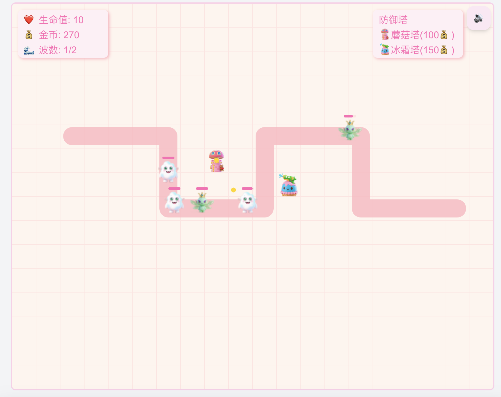

# WIP: Tower defense game

A strategic tower defense game implemented in react & canvas for fun.

## Overview

This project is a modern tower defense game where players strategically place defensive towers to repel waves of enemies. Featuring intuitive controls, challenging levels, and various tower types, it offers an engaging gaming experience for players of all skill levels.

## Features

- Multiple Tower Types: Each with unique abilities (e.g., slow effect, ranged attack, area damage).
- Dynamic Enemy Waves: Enemies with varying health, speed, and attack patterns.
- Upgradable Towers: Enhance tower stats for greater effectiveness.
- Interactive Maps: Strategically place towers to block enemy paths.
- Resource Management: Balance currency usage for towers and upgrades.
- Progression System: Unlock new towers and maps as players advance.

## How to Play

- Place Towers: Use the in-game currency to place towers on the map.
- Upgrade Towers: Increase damage, range, or special abilities.
- Defend Paths: Strategically position towers to block enemy routes.
- Survive Waves: Defeat all enemies in each wave to progress.
